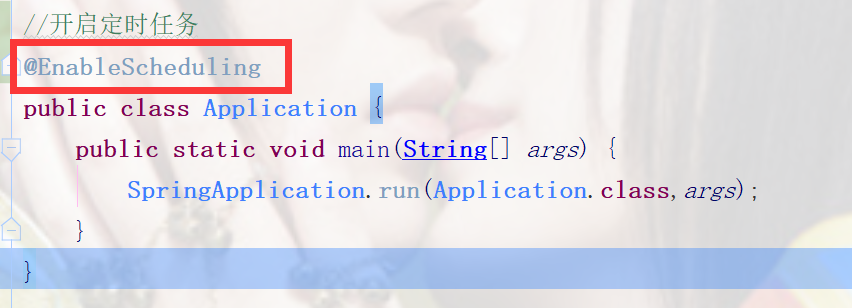
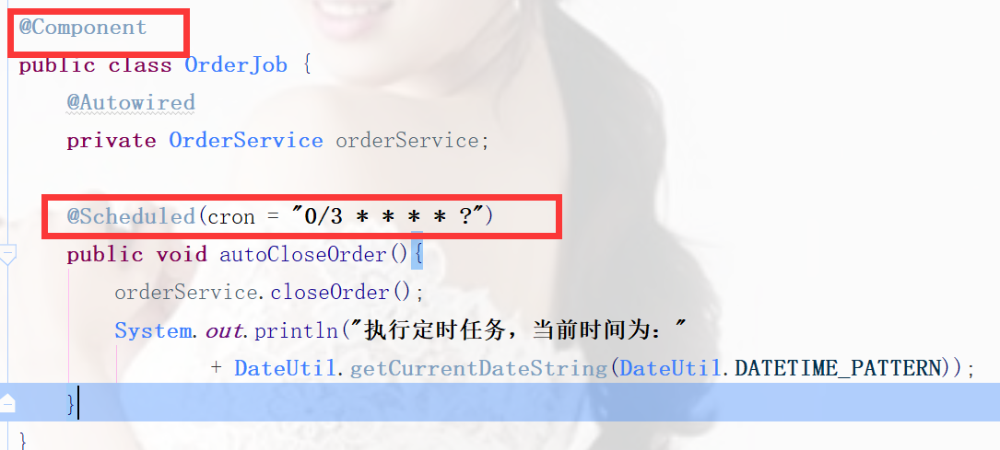
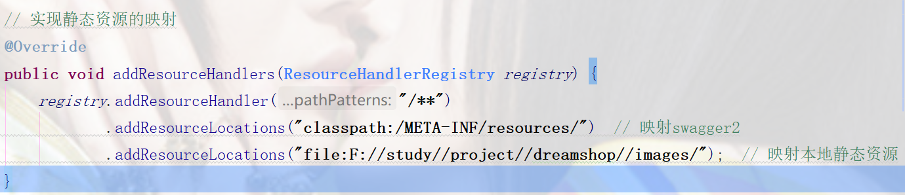

```git
git pull origin master
```

# 学习随笔

##### 1.@Controller与@RestController区别

@Controller是SpringMVC中常用的注解，可通过视图解析器执行页面跳转；@RestController是前后端分离时常用的注解，为@ResponseBody+@Controller两个注解相加，即在该Controller所有方法上都添加@ResponseBody注解，代表此Controller返回的都为json字符串，不可执行页面跳转。

若在Controller注解为@Controller，在某方法添加@ResponseBody注解，也可实现该方法返回json字符串。

@RestController后面不能直接跟路径

##### 2.SpringBoot注解@SpringBootApplication

包含三个注解

```java
@ComponentScan
/*这个注解是扫描本包及其子包下想让容器管理的类，即添加注解@Component，@Repository，@Service，@Controller的类，对应以前xml配置文件中的<context:component-scan>*/
@EnableAutoConfiguration
/*该注解的作用为启动自动的配置，就是根据jar包配置项目所需要的默认配置，如根据spring-boot-starter-web，会自动配置web项目所需的默认配置*/
@SpringBootConfiguration
/*该注解继承自@Configuration，功能也是相似的，即标注此类为配置类，且若此类中有添加@Bean的方法，则把返回值作为实例纳入到容器中管理，该实例名字为方法名*/
```

开启自动装配的就是@EnableAutoConfiguration。

##### 3.找到SpringBoot有哪些自动装配

@SpringBootApplication
-->
@EnableAutoConfiguration
-->
AutoConfigurationImportSelector.class
-->
getCandidateConfigurations()
-->
META-INF/spring.factories

##### 4.数据库连接池**HiKariCP**

<https://github.com/brettwooldridge/HikariCP>

优点：

1. 字节码精简：优化代码，直到编译后的字节码最少，这样，CPU缓存可以加载更多的程序代码；

  优化代理和拦截器：减少代码，例如HikariCP的Statement proxy只有100行代码，只有BoneCP的十分之一；

2. 自定义数组类型（FastStatementList）代替ArrayList：避免每次get()调用都要进行range check，避免调用remove()时的从头到尾的扫描；

3. 自定义集合类型（ConcurrentBag）：提高并发读写的效率；

4. 数据库连接中断处理：等待5秒钟后，如果连接还是没有恢复，则抛出一个SQLExceptions 异常；后续的getConnection()也是一样处理。

##### 5.数据源连接数

HiKariCP中默认最大最小都为10，生产中一般5（最小）—— 20（最大）。

##### 6.mybatis-generator生成问题

若以model形式存在时，需将配置文件**generatorConfig.xml**放在父项目根目录下，生成的pojo、mapper文件将会在父项目的src和resources中。

注：若不确定文件所放位置，可以用new File的形式创建一个文件，看看放在哪里。

##### 7.Propagation事务传播机制

- REQUIRED（默认）  使用当前的事务，如果没有事务，则新建一个事务，子方法必须运行在一个事务中；
  ​		  如果当前存在事务，则加入这个事务，成为一个整体。
  ​		  ex：领导没饭吃，我有钱，我买了自己吃；领导有饭吃，分给我一块吃。

- SUPPORTS  如果当前有事务，则使用事务；没有事务，则不使用事务。

  ​			 ex：领导有饭吃，分我一块吃；领导没饭吃，一块没饭吃。

- MANDATORY  该传播属性强制要求必须有一个事务，若没有则抛出异常。

  ​			    ex：领导必须管饭，若没饭，我就造反（抛出异常）。

- REQUIRES_NEW  如果当前有事务，则挂起事务，新建一个事务；
   ​		                 若没事务，则同REQUIRED；
     			           ex：领导有饭吃，我偏不吃，自己买着吃。

- NOT_SUPPORTED  如果有事务，则挂起事务，自己不使用事务去操作数据库。
   		​	   ex：领导有饭吃，我偏不吃，偏饿着。
- NEVER  如果当前有事务，则抛出异常。
   ​	   ex：领导有饭给你吃，我不吃，还要造反（抛出异常）。
- NESTED  如果有事务，则开启一个子事务（嵌套事务）。子事务独立提交或独立回滚。
   		如果没事务，则同REQUIRED。
      		如果主事务提交，则带上子事务一块提交。
      		如果主事务回滚，则带着子事务一块回滚。
      		如果子事务回滚，主事务可以选择回滚或者不回滚。
      		ex：领导决策不对，老板怪罪，领导带着小弟一块受罚；小弟犯错，老板怪罪，领导可以选择推卸责任或者一块受罚。

SpringBoot自动装配中默认开启了事务管理（@EnableTransactionManagement），以aop形式插入动态代理配置中。

##### 8.@RequestBody

​	此注解为Spring框架中对于请求参数的注解，放在方法中代表此请求参数为json字符串形式；

​	也可在Controller类上方加，代表此类每个方法请求参数都为json字符串形式。

##### 9.cookie和session

cookie:

- 在浏览器中以键值对的形式存储信息
- cookie不能跨域，当前以及父级域名可以取值
- cookie可以设置有效期
- cookie可以设置path

session：

- 基于服务器内存的缓存（非持久化），可保存请求对话
- 每个session通过sessionid来区分
- session可设置过期时间
- session以键值对形式存在

##### 10.AOP通知方式

- 前置通知：在方法调用之前执行
- 后置通知：在方法正常调用之后执行
- 环绕通知：在方法调用之前和之后，都分别可以执行的通知
- 异常通知：如果在方法调用过程中发生异常，则通知
- 最终通知：在方法调用之后执行

##### 11.JAVA常见对象类型

- PO    Persistant Object  持久化对象（数据库表对应对象）

PO就是持久化后的对象，一般来说，一个PO对象对应一个数据库表的一行数据，内不应该涉及业务逻辑及操作，只应该在与DB转化数据存在，不应暴露给Client和上层

- BO    Business Object  业务对象（前端给后端传的对象形式）

BO是业务对象，是把业务逻辑封装成的对象，这个对象可以包括一个或者多个其他对象，用来处理业务逻辑，比如学习经历当成一个BO对象，其中的具体属性可包括初中经历、大学经历等等，属性又可以单独作为一个BO对象，属性的属性也可以单独作为BO对象

- VO    View Object  表现层对象 / Value Object  值对象（（后端给前端传的对象形式））

VO就是对外展示的对象，如在web表现层展示，在SWT、SWING的一个界面，或者Android的界面

- DTO    Data Transfer Object  数据传输对象

##### 12.购物车常见实现方式

- cookie

  存储在浏览器端，数量大小有限制，换浏览器就没了，适合未登录时使用

- session

  存储在服务器，基于内存，用户量越庞大服务器内存压力越大

- 数据库

  存储在数据库，频繁读取数据库，数据库压力大，不推荐

- redis

  基于内存读取，速度快，持久化到硬盘，对服务器内存压力不大，适合分布式以及集群方式（推荐）

推荐：cookie+redis（京东）

##### 13.spring构建定时任务

1. 在配置类开启定时任务，@EnableScheduling



2. 书写配置类，添加注解@Scheduled，cron为时间周期表达式，参考<http://cron.qqe2.com/>



##### 14.定时任务弊端以及改进方式

使用定时任务关闭超期未支付订单，会存在的弊端：

1. 会有时间差，程序不严谨
  10:39下单，11:00检查不足1小时，12:00检查，超过1小时多余39分钟
2. 不支持集群
  单机没毛病，使用集群后，就会有多个定时任务
  解决方案：只使用一台计算机节点，单独用来运行所有的定时任务
3. 会对数据库全表搜索，及其影响数据库性能：select * from order where orderStatus = 10;
  定时任务，仅仅只适用于小型轻量级项目，传统项目

改进方式：消息队列：MQ-> RabbitMQ, RocketMQ, Kafka, ZeroMQ...
  延时任务（队列）
  10:12分下单的，未付款（10）状态，11:12分检查，如果当前状态还是10，则直接关闭订单即可

##### 15.SpringBoot中使用hibernate.validator进行参数校验

​	在springBoot-start已经内置添加了hibernate.validator检验的pom依赖，可直接使用。

使用方法：

1. ​	在BO对象中添加检验规则：在属性上方添加对应注解即可

如下：

```java
@NotBlank(message = "用户昵称不能为空")
@Length(max = 12, message = "用户昵称不能超过12位")
private String nickname;

@Length(max = 12, message = "用户真实姓名不能超过12位")
private String realname;

@Pattern(regexp = "^(((13[0-9]{1})|(15[0-9]{1})|(18[0-9]{1}))+\\d{8})$", message = "手机号格式不正确")
private String mobile;

@Email
private String email;

@Min(value = 0, message = "性别选择不正确")
@Max(value = 2, message = "性别选择不正确")
private Integer sex;
```

2. 在需要校验参数前加注解**@Valid**，且添加接收参数**BindingResult result**，校验结果存在result中

如下：


详细使用参数参考：

```java
/**
* Bean Validation 中内置的 constraint 
* @Null 被注释的元素必须为 null 
* @NotNull 被注释的元素必须不为 null 
* @AssertTrue 被注释的元素必须为 true 
* @AssertFalse 被注释的元素必须为 false 
* @Min(value) 被注释的元素必须是一个数字，其值必须大于等于指定的最小值 
* @Max(value) 被注释的元素必须是一个数字，其值必须小于等于指定的最大值 
* @DecimalMin(value) 被注释的元素必须是一个数字，其值必须大于等于指定的最小值 
* @DecimalMax(value) 被注释的元素必须是一个数字，其值必须小于等于指定的最大值 
* @Size(max=, min=) 被注释的元素的大小必须在指定的范围内 
* @Digits (integer, fraction) 被注释的元素必须是一个数字，其值必须在可接受的范围内 
* @Past 被注释的元素必须是一个过去的日期 
* @Future 被注释的元素必须是一个将来的日期 
* @Pattern(regex=,flag=) 被注释的元素必须符合指定的正则表达式 
* Hibernate Validator 附加的 constraint 
* @NotBlank(message =) 验证字符串非null，且长度必须大于0 
* @Email 被注释的元素必须是电子邮箱地址 
* @Length(min=,max=) 被注释的字符串的大小必须在指定的范围内 
* @NotEmpty 被注释的字符串的必须非空 
* @Range(min=,max=,message=) 被注释的元素必须在合适的范围内 
*/ 
private Long id; 
@Max(value=20, message="{val.age.message}") 
private Integer age; 
@NotBlank(message="{username.not.null}") 
@Length(max=6, min=3, message="{username.length}") 
private String username; 
@NotBlank(message="{pwd.not.null}") 
@Pattern(regexp="/^(?![0-9]+$)(?![a-zA-Z]+$)[0-9A-Za-z]{6,10}$/", message="密码必须是6~10位数字和字母的组合 
private String password; 
@Pattern(regexp="^((13[0-9])|(15[^4,\D])|(18[0,5-9]))\d{8}$", message="手机号格式不正确") 
private String phone; 
@Email(message="{email.format.error}") 
private String email;
```

##### 16.不同操作系统间使用文件路径的不同

​	在UNIX系统中，文件路径分隔符为“/”，在windows中为“\\”<!--为双斜杠“\\”，此因md格式隐去一个-->

，在java中可以以代码File.separator获取当前系统的文件路径分隔符。

##### 17.在SpingBoot中实现静态资源的映射

1. 在配置类中配置，此配置类需继承接口**WebMvcConfigurer**（org.springframework.web.servlet.config.annotation.WebMvcConfigurer）
2. @Override实现方法addResourceHandlers，添加路径



注意：若使用了swagger2需注意将swagger2的资源映射上，不然swagger2无法使用

